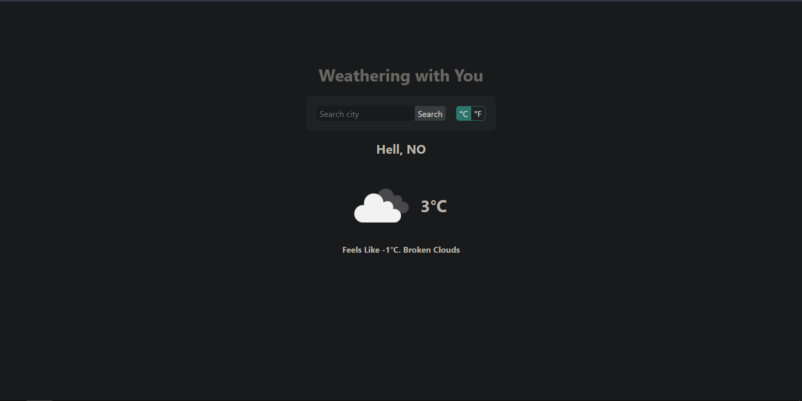

# ☁️ Weather App

Weather App built using HTML, CSS, and JS.

### [View the demo](https://faishalirwn.github.io/weather-app-top/)

## Purpose

The goal of this project is to implement my understanding of Asynchronous JavaScript and APIs.

Features used:

- Promises
- Async and await
- Fetch API
